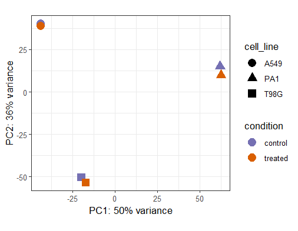
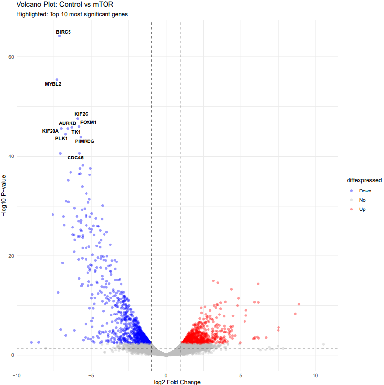
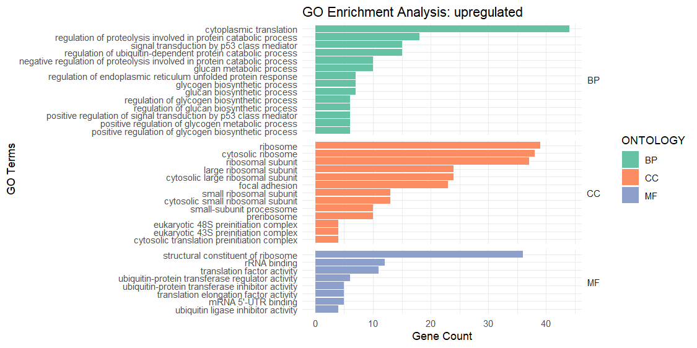
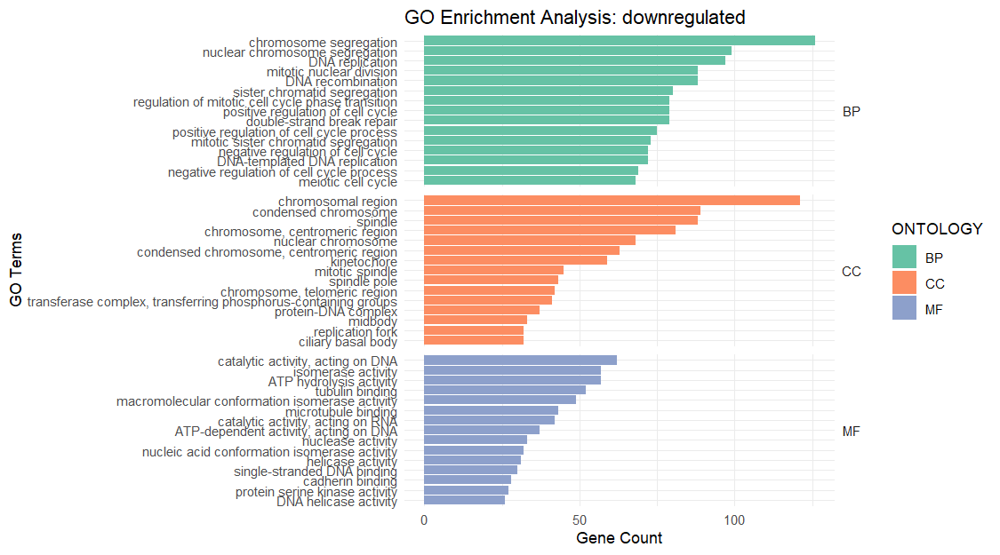
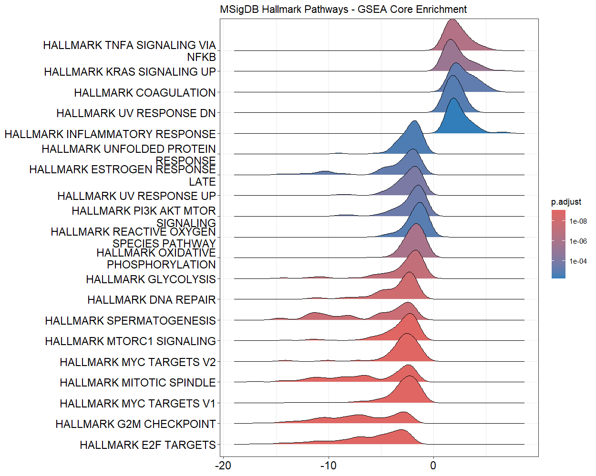
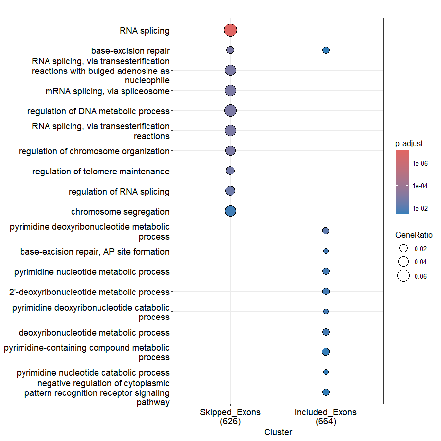
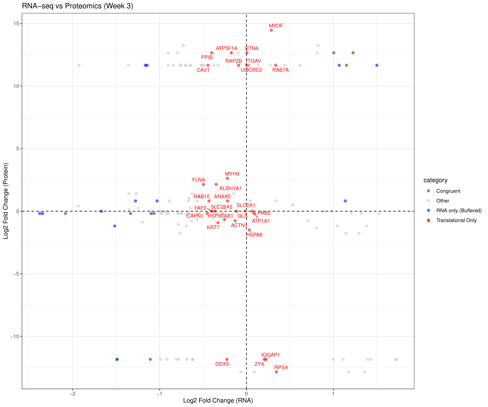

# Transcriptomic Landscape of Cancer Cell Dormancy with Proteomic Integration

Repository for the final project in Bioinformatics Institute (2025-2026) and part of Master's thesis in Saint-Petersburg University (2024-2026)

**Author**: Elina Iskhakova 
> iskhakova.elina18@gmail.com
> Telegram: @Linailinai

**Supervisor**: Irina Suvorova, _Institute of Cytology of the Russian Academy of Sciences, St. Petersburg, Russia_

## About the project

Cancer cell dormancy is a critical latent state where tumor cells remain quiescent, often serving as a primary driver of clinical recurrence. While reversible cell cycle arrest in the G0/G1 phase is recognized as a hallmark of dormancy, the specific signaling networks and molecular markers defining this state remain poorly understood.

A well-established molecular feature of cancer dormancy across various malignancies is the suppression of the mTOR signaling pathway. Inhibiting mTOR downregulates global protein synthesis, which fundamentally reshapes the cellular proteome and rewires translational mechanisms to facilitate the dormancy transition. This proteostatic shift involves the systematic elimination of proliferation-associated proteins and the selective synthesis of proteins required for survival and adaptation.

Despite extensive research on mTOR inhibitors, global proteomic shifts and specific translational alterations in mTOR-deficient dormant cells remain largely unexplored. Furthermore, transcriptional changes alone cannot accurately predict phenotypic adaptation. To overcome this limitation, this project leverages an integrative multi-omics approach, combining RNA-Seq (transcriptomics) and Mass Spectrometry (proteomics) to provide a comprehensive, high-resolution map of the molecular landscape driving cancer cell dormancy.

## Aim and objectives
**Aim**: To perform an integrative multi-omics analysis to elucidate the transcriptomic and proteomic landscape of cancer cells during the transition into dormancy induced by mTOR inhibition.

**Objectives**:
1. **Characterize differential gene expression** and key transcriptomic signatures of dormant cancer cells following mTOR inhibition.
2. Evaluate **alterations in alternative splicing** patterns associated with the dormancy phenotype. 
3. **Profile the proteome of dormant cancer cells** using mass spectrometry data to identify differentially abundant proteins. 
4. **Perform integrative analysis to correlate** transcriptomic shifts with proteomic data.

---
## Structure of repository

```text
├── README.md                  <- Project overview and user guide
├── scripts/                   <- Automated pipeline and analysis scripts
│   ├── 01_rna_seq_preprocessing.sh <- Raw data conversion, Quality Control, and fastp trimming
│   ├── 02_kallisto.sh             <- Transcriptome-level pseudoalignment and quantification
│   ├── 03_hisat2_and_rmats.sh     <- Genome mapping and Alternative Splicing analysis via rMATS
│   ├── 04_deseq2_analysis.R       <- Differential Gene Expression (DGE) analysis via DESeq2
│   ├── 05_functional_enrichment.R <- ORA (GO, KEGG) and GSEA (MSigDB Hallmarks) on DEGs
|   ├── 06_splicing_analysis.R     <- Alternative Splicing evaluation (maser) and DEG integration
│   └── 07_proteome_and_integration.R  <- Proteom analisys and RNA-proteom integration
├── results/                   <- Processed data matrices and outcomes
│   ├── rmats/                     <- Alternative splicing events 
│   ├── differential_expression/   <- DESeq2 output data
|   └── proteome                    <- Mass-spectrometry and proteom analysis data
└── plots/                     <- All key figures
```

---

## Data Analysis Workflow

### 1. Raw Data Preprocessing (`scripts/01_rna_seq_preprocessing.sh`)
* Converts raw `.fastq.bz2` files into `.fastq.gz` using parallelized decompression (`pbzip2` and `pigz`).
* Executes **FastQC** to evaluate baseline sequencing quality metrics.
* Uses **fastp** to perform automated adapter detection, sliding-window low-quality base cutting (window size 4, mean quality < 20), and filtering of reads shorter than 36 bp.

### 2. Transcriptome Quantification (`scripts/02_kallisto.sh`)
* Builds a Kallisto index from the reference transcriptome FASTA file.
* Runs `kallisto quant` in a loop across all processed paired-end samples to estimate transcript abundances in **estimated counts** and **TPM**.

### 3. Genome Alignment & Alternative Splicing (`scripts/03_hisat2_and_rmats.sh`)
* Automatically downloads the human reference genome assembly and structural annotation (**GENCODE Release 44, GRCh38**).
* Generates a genomic index and performs read mapping using **HISAT2**, streaming outputs directly to `samtools sort` to yield coordinate-sorted BAM files.
* Executes **rMATS** to evaluate alternative splicing variations across control vs experimental groups. It captures 5 major events: Skipped Exon (SE), Retained Intron (RI), Mutually Exclusive Exons (MXE), and Alternative 5'/3' Splice Sites (A5SS/A3SS). 

### 4. Differential Gene Expression Analysis (`scripts/04_deseq2_analysis.R`)
* Imports Kallisto estimated count data (`abundance.h5`) using **tximport**, resolving transcript IDs into gene names via the GENCODE GTF map.
* Sets up a multi-factor experimental design (`design = ~ cell_line + condition`) to mathematically control for the biological variance and batch effects across distinct cancer cell backgrounds (**A549, T98G, and PA1**).
* Calculates normalized count transformations via Variance Stabilizing Transformation (**VST**), generates diagnostic **PCA** and sample distance plots, and exports the final sorted table to `results/differential_expression/differential_expression_results.tsv`.

### 5. Functional Enrichment & GSEA (`scripts/05_functional_enrichment.R`)
* **Over-Representation Analysis (ORA)**: Filters DEGs ($p_{adj} < 0.05$, $|\log_2 FC| > 1$) to identify over-represented Gene Ontology (GO) Biological Processes and KEGG Pathways via `clusterProfiler`.
* **Gene Set Enrichment Analysis (GSEA)**: Utilizes a non-threshold-based approach by ranking the entire detected transcriptome via a custom metric ($sign(\log_2 FC) \times -\log_{10}(p\text{-value})$).
* **MSigDB Hallmark Signatures**: Evaluates global phenotypic shifts against the **50 MSigDB Hallmark gene sets** to capture systemic changes (e.g., mTORC1 signaling downregulation, cell-cycle modifications).

### 6. Alternative Splicing Analysis & Multi-Omics Integration (`scripts/06_splicing_analysis.R`)
* **rMATS Integration via maser**: Imports raw Junction Counts (`JC`) from the rMATS workflow and filters high-confidence splicing modifications ($FDR < 0.05$, $|\Delta \text{PSI}| > 0.1$).
* **Isoform Functional Layering**: Categorizes alternative events into Exon Inclusions vs Exon Skippings and performs multi-cluster GO/KEGG functional profiling.
* **Dual-Impact Mapping**: Cross-references alternative splicing (AS) modifications against absolute quantitative gene expression patterns (DESeq2 DEGs). Identifies **Dual-Impact genes** (targets simultaneously controlled via transcriptional variance and post-transcriptional splicing wireframe shifts), producing a final comparative functional map.

### 7. Proteomic Subcellular Integration & Timecourse Correlation (`scripts/07_proteome_and_integration.R`)
* **Subcellular Fractionation Processing**: Normalizes and processes raw spectral count matrices from Cytoplasm and Nucleus proteomic tracking. Computes weekly Expression Kinetics ($\log_2 \text{Fold Change}$) for 1-week, 2-weeks, and 3-weeks updates against baseline controls.
* **Multi-Omics Congruence**: Cross-references localized proteomic shifts with stationary RNA-Seq targets via regular expression string-parsing of Gene Symbols (`GN=`).
* **Multi-Layer Heatmaps**: Employs `ComplexHeatmap` to construct split visualization blocks, pinning baseline total RNA shifts directly against 3-week protein clearance/accumulation profiles.

---
## Installation & Execution Guide

### Prerequisites (Conda Environment)
Ensure you have the required tools installed. You can set up the core upstream environment via Conda:
```bash
conda create -n cancer_dormancy python=3.12 -y
conda activate cancer_dormancy
conda install -c bioconda rmats hisat2 samtools fastqc fastp -y
```

### Running the Upstream Pipelines
1. Place your raw paired-end sequencing reads into a `raw_data/` folder.
2. Execute the bash pipelines sequentially:
   ```bash
   ./scripts/01_rna_seq_preprocessing.sh
   ./scripts/02_kallisto.sh
   ./scripts/03_hisat2_and_rmats.sh
   ```

### Running the R Downstream Analysis
Open your R environment/IDE and run the R scripts in order:
```R
source("scripts/04_deseq2_analysis.R")
source("scripts/05_functional_enrichment.R")
source("scripts/06_splicing_analysis.R")
source("scripts/07_proteome_and_integration.R")
```

---

## Data Availability
The raw FASTQ sequencing files and intermediate BAM tracks generated during this study are proprietary and currently not publicly available due to upcoming publication pending. 

To maintain transparency and reproducibility without exposing raw files, the pre-calculated alternative splicing matrices (`results/rmats/`) and the final annotated differential gene expression dataset (`results/differential_expression/differential_expression_results.tsv`) **are available directly within this public repository**.

---

## Key Results & Visualizations

All key figures and biological visualizations generated by the downstream R pipelines are available in the `plots/` directory. Below is the summary of the multi-omics landscape of cancer cell dormancy:

### 1. Transcriptomic Profile & Quality Control
* **Exploratory Data Analysis**: The **PCA Plot** confirms distinct separation between control and mTOR-inhibited conditions while effectively accounting for the biological variance across the A549, T98G, and PA-1 cell backgrounds.



* The **Volcano Plot** highlights robust differentially expressed genes (DEGs).


  
* **Functional Restructuring (ORA GO)**: 
  * **Upregulated Processes**: Enriched in cytoplasmic translation regulation, cytoplasmic transport, and cellular homeostasis pathways.

 

  * **Downregulated Processes**: Heavily concentrated in cell cycle progression, chromosome segregation, and DNA replication machinery.

 

   
* **Systemic Phenotypes (GSEA Hallmarks)**: 
  * The **Hallmarks Dotplot** visually documents a drastic downregulation of `MYC Targets`, `E2F Targets`, `G2M Checkpoint`, and `mTORC1 Signaling`.

 


### 2. Alternative Splicing Remodeling
* **Skipped Exons Functional Impact**: Alternative splicing events filtered via `maser` reveal that **Skipped Exons (SE)** represent the most abundant splicing modification. 
* **Splicing GO Enrichment**: The genes undergoing extensive exon remodeling are directly tied to mRNA splicing pathways, RNA surveillance, DNA repair, and mitotic spindle assembly, confirming a post-transcriptional wireframe shift during dormancy entry.
*
*  


### 3. Proteomic Adaptation & Subcellular Integration
* Evaluated via multi-week Mass-Spectrometry time-course analysis (Weeks 1, 2, and 3) in the A549 cell line.
* **Expression Shifts & Cross-Omics Sync**: The **RNA-Protein Integration Scatter Plot** charts the co-regulation patterns, highlighting the key signatures driving phenotypic adaptation:
  * **Translation Suppression**: Drastic reduction of ribosomal proteins (RPS family) and `RACK1`.
  * **Autophagy & Lysosomal Activation**: Steady accumulation of `SQSTM1/p62`, `RAB7A`, `RTN4`, and `CAV1`.
  * **Amino Acid Sensing**: Readjustment of `SLC7A5` transporters.
  * **Stress Adaptation**: Upregulation of chaperones (`HSPA8`, `HSP90AA1`) and ER stress-responsive survival proteins.

 


---

## Conclusions

Based on the integrative transcriptomic, post-transcriptional (splicing), and subcellular proteomic analysis, we conclude the following:

1. **Transcriptional Arrest**: mTOR inhibition successfully drives cancer cells into a dormant phenotype, fundamentally suppressing cellular proliferation, DNA replication, and core proto-oncogenic transcription programs, specifically downregulating **E2F** and **MYC targets**.
2. **Post-Transcriptional Rewiring**: The transition into cancer cell dormancy is accompanied by extensive and coordinated **alternative splicing remodeling**, predominantly driven by skipped exon (SE) configurations targeting the cell's splicing machinery itself.
3. **Proteostatic Survival Adaptation**: Subcellular proteomic adaptation over the 3-week timeline establishes a highly resilient survival program characterized by the suppression of global translation alongside the active activation of **autophagy, lysosomal biogenesis, ER stress mitigation systems**, and global **metabolic rewiring**.

---
